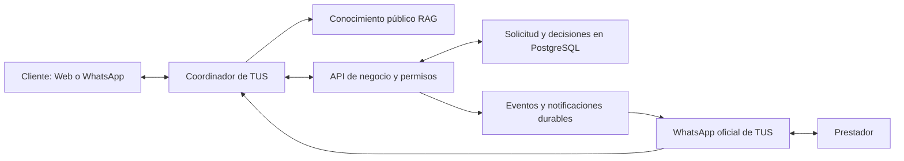

**Auditoría de preparación de TUS para RAG y coordinación por WhatsApp — 27/09/2026**

Dictamen: hay una base implementada y el conocimiento público responde en producción. No está listo el circuito automático completo cliente → prestador → cliente. Tampoco queda aprobada para desplegar la fase pendiente de autenticación.

**Alcance y evidencia**

- Lectura del working tree, composición de API, autenticación, recuperación de conocimiento, asistente Web, herramientas del asistente, persistencia, cola, integración Meta y solicitudes dirigidas.
- HEAD local: `2878a30`. La API pública devuelve `2878a30b5bd639a292229fcefca6fd0cdded8c81` en `/version`.
- `/health`: `ok`; `/ready`: `ready=true`, PostgreSQL listo y proveedores externos declarados `disabled`. Readiness no certifica la funcionalidad del bot.
- GET `/tus/v1/integrations/whatsapp/webhook`: HTTP 404, `WhatsApp is not enabled`. Confirma deshabilitación del canal, independientemente del readiness general.
- POST de consulta pública a `/tus/v1/asistente/ayuda`, pregunta `Que es TUS?`: HTTP 200, `status=answered`, `strategy=lexical`, fuentes `que-es-tus` y `asistente-whatsapp`.
- 30 tests superiores de Node aprobados, cero fallos, en siete archivos: `tus-auth-email-cookie` (8), `tus-rag-evaluacion` (2), `whatsapp-asistente` (4), `whatsapp-rag` (4), `whatsapp-webhook` (2), `p9-identity-http` (3) y `tus-admin-mfa` (7). Varios contienen múltiples escenarios internos.
- Reproducción adicional aislada con una herramienta de escritura lenta: devolvió `TOOL_TIMEOUT` y el mensaje «No se hizo ningún cambio»; después la operación terminó y cambió su estado.
- No se ejecutaron suite completa, E2E de navegador, build nuevo, ensayo de PostgreSQL descartable ni prueba con Meta/Resend reales. Los éxitos informados en la sesión anterior no se presentan como verificaciones nuevas.
- No se modificó código de producto, no se commiteó ni desplegó. Este informe es el único archivo agregado por la auditoría. No se enviaron mensajes a usuarios ni prestadores.

**Capacidades existentes**

| Capacidad | Evidencia y límite |
| --- | --- |
| Conocimiento público | Ingesta Markdown, fragmentos, versiones, checksum, desactivación y recuperación léxica. Respuesta pública comprobada en producción. |
| Búsqueda vectorial | Adapter PostgreSQL/pgvector y proveedor compatible con API de embeddings. Dimensión fija de 1024. No se verificó un proveedor semántico real; la consulta productiva observada fue léxica. |
| Filtrado de conocimiento | Visibilidad y audiencia filtradas antes del ranking en SQL. Conocimiento interno excluido del recuperador conversacional. |
| Asistente Web | `/asistente` ya existe: interpreta necesidad, pregunta zona/urgencia/presupuesto, busca candidatos y permite solicitar un prestador. Ayuda pública extractiva. No comparte una conversación durable completa con WhatsApp. |
| Asistente WhatsApp | Meta Cloud API, firma del webhook, deduplicación de ingresos, cola PostgreSQL, worker, historial/resumen, herramientas y derivación humana. Canal deshabilitado en producción. |
| Identidad y acciones | Vinculación de cuenta, autoridad consultada por turno, validación estricta de argumentos y confirmaciones ligadas a cuenta/contacto/conversación. |
| Negocio | Herramientas para búsqueda, solicitudes, postulaciones, elección, trabajos, presupuestos y pago. Algunas familias de solicitudes son distintas y no cubren los mismos pasos. |
| Plantillas | Definiciones y lista local de nombres aprobados. No constituye evidencia de aprobación efectiva en Meta ni de un emisor automático conectado a cada evento. |

**Hallazgos prioritarios**

1. **Alta — falta completar la coordinación entre las dos partes.** `apps/api/src/tus/solicitudes/servicio.ts:84` crea una solicitud dirigida y `:131` la guarda. Ese camino no publica un evento de notificación ni llama al canal. `asistente/dominio.ts:133` utiliza ese mismo servicio. El catálogo de `asistente/herramientas.ts` no ofrece aceptar/rechazar la solicitud dirigida recibida; listar trabajos del prestador no sustituye esa bandeja. El texto de éxito promete «le envié tu solicitud», pero no demuestra entrega por WhatsApp. Completar eventos transaccionales, destinatario vinculado, herramientas de respuesta del prestador y aviso de vuelta al cliente.

2. **Alta — resultado falso ante timeout de una escritura.** `asistente/herramientas.ts:428` usa `Promise.race`: vence la espera, pero no cancela la operación. `asistente/orquestador.ts:617` la marca fallida y `:893` afirma que no hubo cambios. Reproducción confirmada con dominio simulado, sin modificar datos reales. Incorporar estado pendiente/resultado desconocido, reconciliación y clave de idempotencia durable; solo anunciar fracaso definitivo cuando esté demostrado. `solicitarPrestador` no recibe la clave de idempotencia de la confirmación, a diferencia de otras herramientas.

3. **Alta — recuperación incompleta después de interrupciones.** Una confirmación pasa de `pending` a `confirmed` antes de ejecutar el dominio; `orquestador.ts:580` rechaza volver a ejecutar una que quedó `confirmed`. Una caída en ese intervalo puede dejar una acción sin realizar y sin recuperación. Los envíos `pending_send`/`unknown` previenen reenvíos ciegos, pero requieren reconciliación o atención operativa. Agregar pruebas de caída antes/después de persistir el negocio y antes/después de enviar a Meta. No usar reintentos indiscriminados para resolverlo.

4. **Alta antes de habilitar WhatsApp — revisar ventana y consentimiento al enviar.** El operador humano valida las 24 horas en `asistente/soporte.ts:135`. El camino automático `orquestador.ts:743`/`:936` no vuelve a comprobar esa ventana ni el consentimiento antes del envío. Una cola atrasada puede procesar mensajes vencidos. Centralizar estas reglas para bot, operador y notificaciones; contemplar baja, bloqueo, plantilla aprobada y fallo de entrega. La política oficial exige consentimiento, plantillas fuera de ventana y acceso claro a atención humana: https://business.whatsapp.com/policy.

5. **Alta para liberar autenticación — cerrar el E2E de email y configurar envío antes de abrir el registro.** Sin Resend configurado se crea una cuenta pendiente, pero no se entrega el enlace; esa cuenta no puede iniciar sesión con contraseña hasta verificar. Es persistencia de registro, no onboarding funcional. Configurar proveedor, remitente/dominio verificado y URL Web antes de habilitar el flujo. Probar registro, correo recibido, enlace, login, reset, revocación y MFA desde navegador real.

6. **Media — lectura destructiva del token en los efectos React.** `apps/web/src/features/auth/email-flows.tsx:16` lee y elimina el token de la URL; `:145` guarda el resultado en cada ejecución del efecto. Una segunda ejecución puede reemplazar el token de reset por vacío. `VerifyEmailFlow` tiene un patrón relacionado, aunque su primera petición puede terminar restaurando el estado verificado. `next.config.js` activa StrictMode. React documenta la repetición de efectos en desarrollo: https://react.dev/reference/react/StrictMode. Hallazgo estático; no se demuestra que sea la causa del E2E anterior. Conservar una captura estable y hacer los efectos tolerantes a repetición; inspeccionar también respuesta HTTP, hash/consumo del token, consola, CSP y URL de API en ese E2E.

7. **Media — build local con URL de prueba.** Hay múltiples bundles en `apps/web/.next/static` que contienen `localhost:4100`. Confirmado. Reconstruir con la configuración prevista antes de validar el artefacto. Esto no demuestra que el build independiente de Vercel use esa dirección.

8. **Media — configuración de cookie permite degradación en producción.** `auth-security/http/session-cookie.ts:27` acepta `TUS_SESSION_COOKIE_SECURE=false` sin comprobar entorno y pasa a cookie sin `Secure` ni prefijo `__Host-`. No se verificó esa configuración insegura en producción. Rechazarla al arrancar en producción; permitir excepción únicamente en desarrollo HTTP.

9. **Media — conocimiento publicado promete un canal apagado.** La respuesta real a `Que es TUS?` menciona WhatsApp oficial y atención humana por ese chat, aunque su webhook está deshabilitado. También priorizó la sección «Canales», no una definición general. Revisar corpus y ranking con PostgreSQL real; los tests de evaluación actuales usan índice en memoria y embeddings locales deterministas. No extrapolar sus resultados a calidad semántica con proveedor externo.

**Límites de seguridad del RAG**

El índice del asistente es conocimiento compartido de TUS con audiencias, no un repositorio privado individual: `ContextoRecuperacion` solo tiene `linked` e `isProvider`. No agregar allí presupuestos, DNI, pagos o conversaciones privadas pensando que la audiencia los aísla por persona. Usar las herramientas autorizadas para datos de cada cuenta; si se incorporan documentos privados, añadir ownership/tenant y ACL a ingesta, recuperación y pruebas.

La redacción de PII, el prompt y los filtros aportan defensas, pero no equivalen a garantía de ausencia de filtraciones. Probar mensajes y documentos que intenten cambiar instrucciones, extracción de información de otras cuentas y respuestas inventadas sobre precios/horarios. La disponibilidad, precio vigente y aceptación deben salir del dominio en ese momento, no de documentos ni memoria del modelo.

Los cambios pendientes de autenticación incluyen cookie HttpOnly, control de origen, limitadores PostgreSQL, email y restricción de administración. Los tests seleccionados respaldan casos concretos; falta el recorrido de navegador y la liberación coordinada. La allowlist se consulta en el entorno del proceso: cambiar una variable en Hostinger exige que el proceso reciba la nueva configuración para que el siguiente request la vea.

**Arquitectura propuesta para el pedido**

El coordinador prepara una solicitud estructurada que el cliente aprueba; consulta prestadores elegibles; registra a quién se contactó; recibe aceptación, rechazo o propuesta; vuelve al cliente con opciones reales y espera su decisión. Cada paso conserva requestId, actor, versión, consentimiento, expiración y resultado. No confirmar horarios o precios solo porque el modelo los propuso.

La política de WhatsApp también prohíbe reenviar o compartir información de un chat de cliente con otro cliente. No diseñar el producto como retransmisión de conversaciones privadas. Definir datos estructurados de la operación, permisos y roles de los destinatarios, y validar la aplicabilidad de la política al marketplace antes del piloto. Consentimiento genérico no debe interpretarse como excepción automática a esa prohibición. Fuente: https://business.whatsapp.com/policy, apartado de protección de datos.

La interfaz de búsqueda puede ser conversacional: reutilizar `/asistente`, mostrar candidatos comparables y acciones de confirmar/cancelar. Hace falta conservar conversación/operación en servidor y asociarla a los canales; guardar una necesidad en el navegador no es continuidad multicanal.

**Secuencia de salida recomendada**

1. Cerrar auth: E2E de navegador, email real controlado, MFA, cookies/CSRF en dominios reales; suite completa y build correcto; migración y despliegue con configuración preparada.
2. Estabilizar recuperación de acciones y envíos ambiguos, idempotencia, ventana, consentimiento y reglas de privacidad.
3. Completar solicitud dirigida → notificación → decisión del prestador → respuesta al cliente, con vencimiento, rechazo y derivación humana.
4. Aprobar/configurar plantillas y credenciales Meta, canal y modelo; verificar la salida real. No basta con las variables de email/MFA del resumen anterior.
5. Ejecutar piloto con cuentas controladas: dos conversaciones vinculadas a una solicitud, duplicados, reinicios, respuestas tardías, baja y aislamiento. Medir latencia, fallos, entregas, derivaciones y coste por solicitud resuelta.
6. Ampliar el piloto solo cuando el cliente y el prestador vean el mismo estado confirmado. RAG semántico es una mejora posterior evaluable; no reemplaza esta coordinación.

Procesos persistentes iniciados o dejados por esta auditoría: ninguno. Sin PID pendiente.
